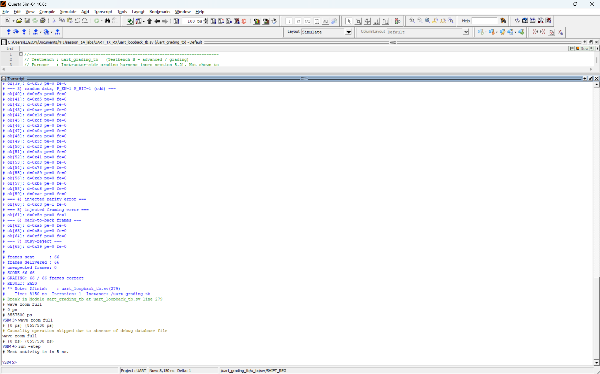
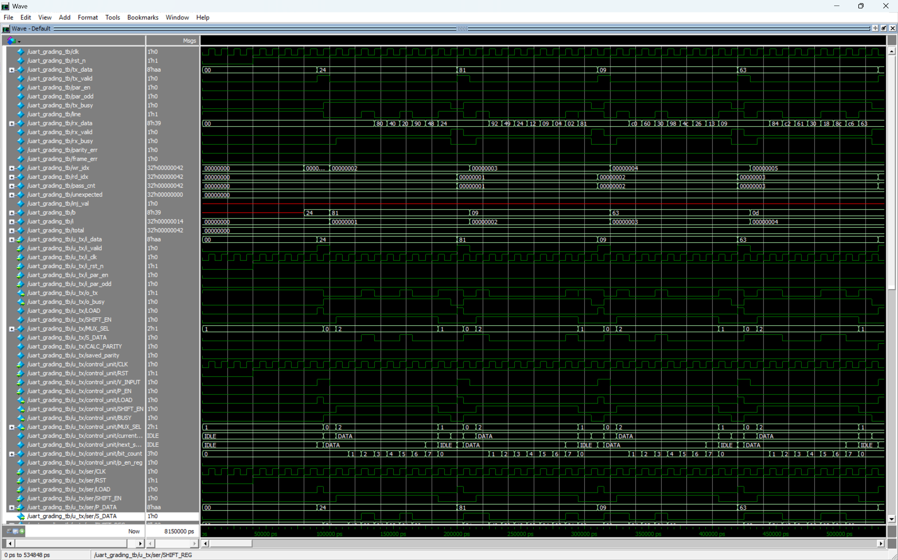
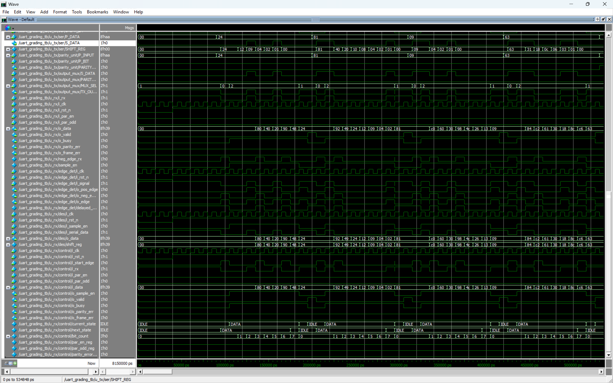

# Full-Duplex UART Using SystemVerilog

This project implements a parameterized full-duplex UART using SystemVerilog. The UART transmitter and receiver are connected together in the provided loopback grading testbench.

The UART frame consists of:

- One start bit (`0`)
- `DATA_W` data bits, transferred least-significant-bit first
- An optional parity bit (even or odd)
- One stop bit (`1`)

In this course project, each UART bit is one clock period long.

## Project Modules

### UART Transmitter

- `serializer.sv`: parallel-to-serial converter.
- `parity_calc.sv`: parity bit calculator.
- `main_controller.sv`: transmitter finite-state machine (FSM) and data-bit counter.
- `mux.sv`: selects which bit (start, data, parity, or stop) to output on the UART line.
- `uart_tx.sv`: connects all the transmitter modules together; stores the calculated parity bit for the current frame.

### UART Receiver

- `rx_edge_detector.sv`: detects the start bit falling edge.
- `rx_deserializer.sv`: shifts in the serial data and converts it to parallel.
- `rx_main_controller.sv`: receiver FSM, data-bit counter, sampling control logic, and parity and framing error detection.
- `uart_rx.sv`: connects all the receiver modules together; outputs received data, status, and errors.

### Testbenches and Simulation

- `serializer_tb.sv`, `parity_calc_tb.sv`, `mux_tb.sv`, and `main_controller_tb.sv`: test individual transmitter modules.
- `uart_tx_tb.sv`: tests the complete `uart_tx` module.
- `uart_loopback_tb.sv`: the instructor-provided grading testbench for the full UART transmitter/receiver loopback.
- `run.do`: compiles the whole design, starts the grading simulation, views the waveforms, and runs the testbench.

## Main Signals

### Transmitter Interface

- `i_data`: data to transmit.
- `i_valid`: indicates that the transmitter should send the data on the next clock cycle when it is idle.
- `i_par_en`: enables or disables parity-bit transmission.
- `i_par_odd`: selects even parity (`0`) or odd parity (`1`).
- `o_tx`: serial UART output.
- `o_busy`: indicates that the transmitter is busy sending a frame.

### Receiver Interface

- `i_rx`: serial UART input.
- `i_par_en`: enables or disables parity checking.
- `i_par_odd`: selects even parity (`0`) or odd parity (`1`).
- `o_data`: received data.
- `o_valid`: indicates that valid data has been received.
- `o_busy`: indicates that the receiver is busy receiving a frame.
- `o_parity_err`: indicates that the received parity bit did not match the expected value.
- `o_frame_err`: indicates that the received stop bit was not `1`.

Both the transmitter and receiver modules take the same clock signal, `i_clk`, and active-low asynchronous reset, `i_rst_n`. The data width is set by the parameter `DATA_W` and is defaulted to 8-bits.

## Operation

When `i_valid` is asserted while the transmitter is idle, the data on `i_data` and parity settings are stored for later transmission. The transmitter outputs the start bit, data bits (LSB-first), optional parity bit, and stop bit. If `i_valid` is asserted again while the transmitter is busy (i.e., while `o_busy` is high), the new request is ignored.

The receiver detects the falling edge of the start bit, samples the data bits, reconstructs the data word, checks the optional parity bit and stop bit, and asserts `o_valid` when the entire frame has been received. The received data word is still output when a parity or framing error is detected with the corresponding error status flags set.

## Simulation

The project was simulated using QuestaSim. To simulate the complete UART loopback testbench, run the following command:

```tcl
do run.do
```

The instructor-provided grading testbench covers:

- 20 random frames with parity disabled
- 20 random frames with even parity enabled
- 20 random frames with odd parity enabled
- One injected parity error
- One injected framing error
- Three back-to-back frames
- One transmission request while the transmitter is busy

All 66 expected frames were received, no extra frames were received, and the testbench received a score of **66/66** from the grading tool.

## Simulation Results

### Grading Result



### UART Loopback Waveforms

The zoomed-in view of the waveforms shows the contents of the UART frames and the internal operation of the transmitter and receiver.





To see the whole picture, see the [top-level full waveform](screenshots/waves_1.png) and the [internal signals full waveform](screenshots/waves_2.png).
